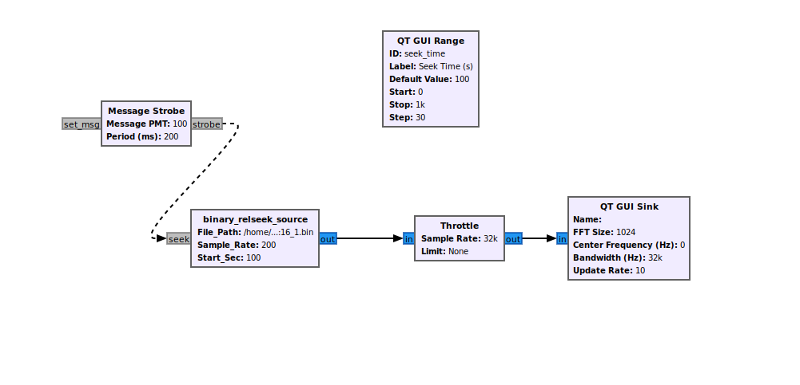

# Digital RF Seek Source block
This is a block that can be used for GNU Radio. It allows you to "jump" around in a Digital_RF file to see different time points in the file. 

## How to use in standard GNU Radio
1. To use this block you will need to drop an "Embedded Python Block" into GNU-Radio. Then open up the editor and copy and past the 
code from ```code.py```. You now have the ```digital_rf_relseek_source``` block. 
2. You will also need a ```throttle``` block, a ```QT GUI Range``` block, and a sink of some sort. In our example we use ```QT GUI Sink```. Finally you will need a ```Message Strobe``` block.
3. In the parameters of the relseek block you will need to input the filepath to the dataset directory, the name of the channel that you are looking at, and the start seconds. 
### Example Usage of the Block 


## How to use in command line
1. You need to download two files.
2. ``` python3 /home/script.py --data-dir "/home/data_folder" --channel "chA" --start-sec 100 --home-dir "/home/data_folder" ``` (Please note that chA should be within the data_folder directory)
3. 
